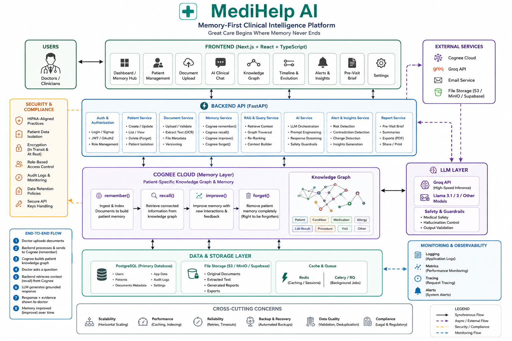
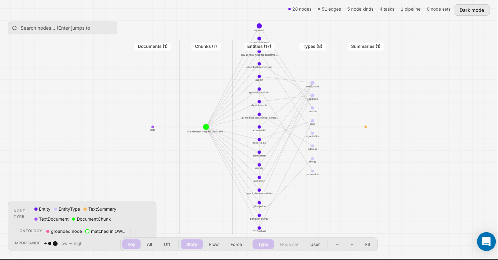
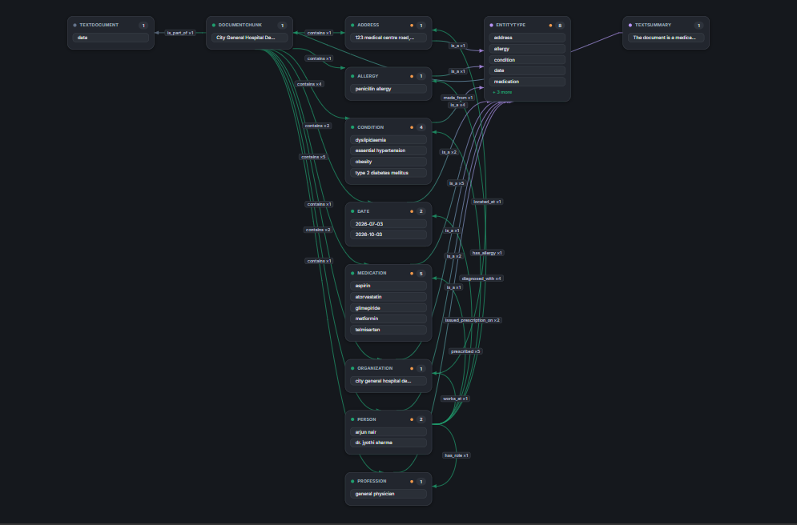
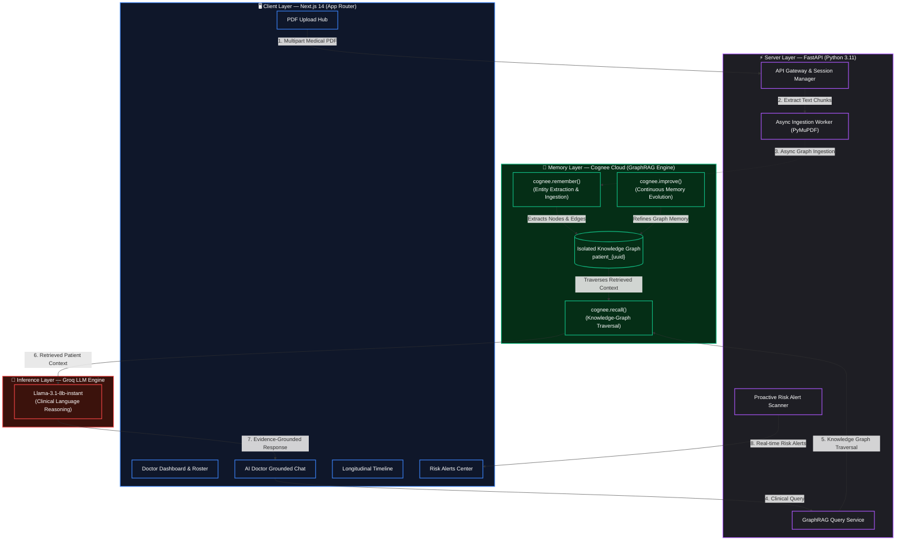
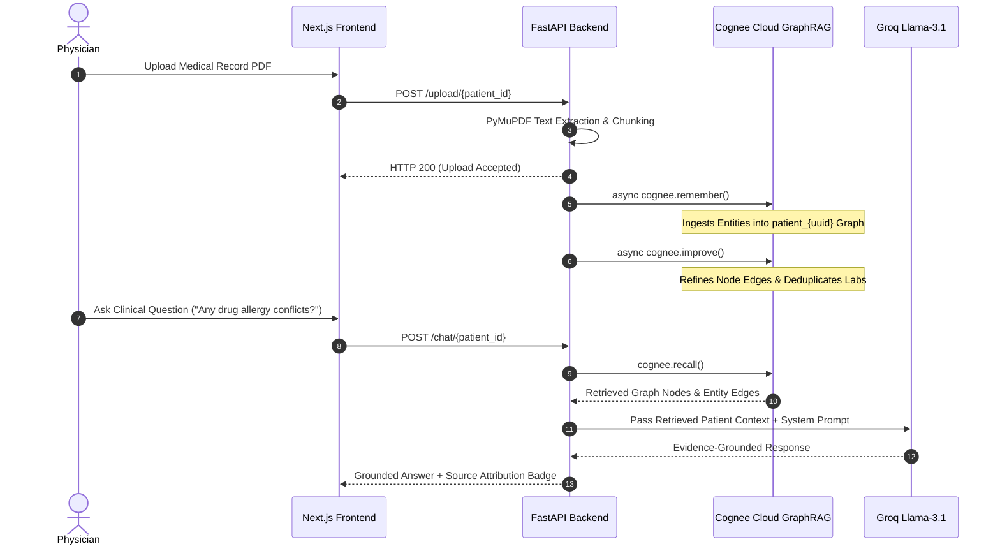

<div align="center">

  # 🧠🩺 MedHelp AI
  ### **Great Care Begins Where Memory Never Ends.**

  A persistent medical memory system for doctors and healthcare teams<br>
  Powered by **Cognee Cloud GraphRAG**, **FastAPI**, and **Next.js 14**

  <p>
    
    
    
    
    
    
  </p>

</div>

---

## 📋 Table of Contents
1. [Executive Summary](#executive-summary)
2. [Clinical Safety Notice](#clinical-safety-notice)
3. [Evidence-Grounded GraphRAG Innovation](#evidence-grounded-graphrag-innovation)
4. [High-Value Clinical Feature Portals](#high-value-clinical-feature-portals)
5. [Visual Feature Showcase](#visual-feature-showcase)
6. [Cognee GraphRAG Memory Engine](#cognee-graphrag-memory-engine)
7. [System Architecture Diagram](#system-architecture-diagram)
8. [Clinical Data Flow Sequence](#clinical-data-flow-sequence)
9. [Quickstart Setup Guide](#quickstart-setup-guide)
10. [Full API Endpoint Reference](#full-api-endpoint-reference)
11. [Security, Privacy & HIPAA-Aligned Practices](#security-privacy--hipaa-aligned-practices)
12. [License & Acknowledgments](#license--acknowledgments)

---

## 👁️ Executive Summary

Most electronic health record (EHR) systems store patient histories across scattered PDF uploads, visit notes, and lab reports. Doctors often spend a huge portion of their day manually digging through old files to find relevant details, which is slow and makes it easy to miss important contraindications or past lab trends.

Standard RAG tools connected to vector databases struggle here because text is broken into arbitrary chunks. They often confuse dates, mix up drug dosages, or combine details across different patients.

**MedHelp AI organizes clinical records into a structured Knowledge Graph.** Using **Cognee Cloud GraphRAG**, the system ingests uploaded medical PDFs, extracts core clinical entities (like diagnoses, medications, lab values, vitals, and allergies), and connects them over time.

Doctors can query patient records through an AI assistant that answers based strictly on retrieved patient context—helping reduce hallucination risks, highlighting potential medication risks, and speeding up pre-visit prep.

---

> [!IMPORTANT]
> ### ⚠️ Clinical Safety Notice
> **MedHelp AI is a decision-support tool meant to help doctors review patient records faster.** It does not provide medical diagnoses or replace professional medical judgment. All clinical decisions remain entirely with the treating doctor. If the system does not find enough patient evidence to answer a question, it states that context is missing rather than guessing.

---

## 🛡️ Evidence-Grounded GraphRAG Innovation

| Legacy EHR / Vector RAG Limitations ❌ | MedHelp AI GraphRAG Approach ✅ |
| :--- | :--- |
| **Fragmented PDF Attachments:** Context is scattered across unorganized documents. | **Unified Knowledge Graph:** Extracts diagnoses, drugs, and lab entities into a dedicated dataset per patient (`patient_{uuid}`). |
| **Vector Search Hallucinations:** Text chunks break mid-sentence, losing context and connections. | **Graph-Based Retrieval:** Connects medical facts with explicit edges. Queries pull answers directly from retrieved graph context (`Source: graph`). |
| **Missed Contraindications:** Allergy and drug conflicts stay hidden in old notes. | **Background Risk Scanning:** Scans uploaded files during indexing to flag drug-allergy conflicts and abnormal lab trends automatically. |
| **Outdated Data Collisions:** Old notes conflict with new visit records. | **Evolving Memory (`improve`):** Deduplicates entities and updates lab trends over time as new documents are added. |
| **Cross-Patient Context Bleeding:** Vector databases can accidentally retrieve data from other patients. | **Isolated Datasets (`forget`):** Patient data is completely separated in memory. Deleting a patient triggers dataset removal via `cognee.forget()`. |

---

## 💎 High-Value Clinical Feature Portals

MedHelp AI includes 5 main views built for everyday clinical workflows:

1. **Grounded AI Doctor Assistant (`/patients/chat`)**:
   - Ask questions about a patient's medical history in plain text. Answers reference specific graph context (`Source: graph`) and organize key takeaways cleanly.

2. **Pre-Visit Snapshot Brief (`/patients/brief`)**:
   - Runs parallel `cognee.recall()` queries to generate a quick 5-point summary covering current risk level, active conditions, prescriptions, lab highlights, and suggested follow-up questions.

3. **Longitudinal Medical Timeline (`/patients/timeline`)**:
   - Displays past medical events in chronological order directly from graph memory, showing diagnoses, medications, and lab results with clear severity badges.

4. **Interactive SVG Mindmap Visualizer (`/patients/mindmap`)**:
   - Renders an interactive visual graph of medical entities, conditions, and medication nodes extracted by Cognee Cloud.

5. **Risk Alert Center & Doctor Rosters (`/alerts` & `/patients/list`)**:
   - Automatically checks uploaded records for drug-allergy conflicts or abnormal lab values. Alerts and patient lists filter dynamically based on the logged-in doctor (`?doctor={name}`).

---

## 🖼️ Visual Feature Showcase

<div align="center">
  
  <p><em>Figure 1: High-Level Architecture — PDF ingestion pipeline and clinical query workflow.</em></p>
</div>

<br/>

<div align="center">
  
  <p><em>Figure 2: Cognee Knowledge Graph Engine — Extracted clinical nodes, lab values, and timestamps.</em></p>
</div>

<br/>

<div align="center">
  
  <p><em>Figure 3: Cognee Knowledge Graph Engine — Entity connections between conditions, drugs, and patient records.</em></p>
</div>

---

## 🧠 Cognee GraphRAG Memory Engine

The backend handles patient memory using Cognee Cloud through four main API calls:

```
       [ Uploaded PDF Medical Records ]
                      │
                      ▼
            cognee.remember()
    (NLP Extraction & Graph Construction)
                      │
                      ▼
             [ Knowledge Graph ]
          Patient Dataset: patient_{uuid}
                      │
         ┌────────────┴────────────┐
         ▼                         ▼
  cognee.recall()           cognee.improve()
 (Graph Traversal)        (Graph Refinement)
         │                         │
         ▼                         ▼
 [ Grounded Response ]     [ Evolving Memory ]
```

- **`remember()`**: Parses uploaded PDFs using PyMuPDF and extracts medical entities into a patient-specific graph.
- **`recall()`**: Traverses the graph to retrieve relevant context when a doctor asks a question or requests a brief.
- **`improve()`**: Merges duplicate entities and updates lab trends over time as new documents are uploaded.
- **`forget()`**: Deletes the patient's graph dataset whenever a patient profile is removed.

---

## 📐 System Architecture Diagram



---

## 🔄 Clinical Data Flow Sequence



---

## 💻 Quickstart Setup Guide

### Prerequisites
* **Node.js**: `v18.0.0+` | **Python**: `v3.10+` | **Managers**: `npm` and `pip`

### Step 1: Clone Repository
```bash
git clone https://github.com/MohanrajCit/MedHelp.git
cd MedHelp
```

### Step 2: Launch Backend
```bash
cd backend
python -m venv venv
source venv/bin/activate  # On Windows: .\venv\Scripts\activate
pip install -r requirements.txt
python -m uvicorn main:app --reload --port 8000
```
*Verify Backend Health: Open `http://localhost:8000/health` (`{"backend": "ok"}`).*

### Step 3: Launch Frontend
In a new terminal window:
```bash
cd frontend
npm install
npm run dev
```
*Open `http://localhost:3000` in your browser.*

---

## 🌐 Full API Endpoint Reference

### Base URL: `http://localhost:8000`

| Method | Endpoint | Query / Body | Description |
| :--- | :--- | :--- | :--- |
| `GET` | `/health` | — | Server health check & service status |
| `GET` | `/patients/list` | `?doctor={name}` | Fetch doctor-scoped patient roster |
| `POST` | `/patients/create` | `{ name, age, gender, doctor }` | Create a new patient record |
| `DELETE` | `/patients/{id}` | — | Delete patient record & invoke `cognee.forget()` |
| `POST` | `/upload/{id}` | Multipart Form (`file`) | Upload PDF → PyMuPDF extraction → `cognee.remember()` |
| `POST` | `/chat/{id}` | `{ question }` | AI Doctor chat grounded in retrieved patient context |
| `GET` | `/memory/{id}/timeline` | — | Recalls chronological timeline events |
| `GET` | `/memory/{id}/mindmap` | — | Returns SVG knowledge graph nodes & edges |
| `POST` | `/brief/{id}` | — | Generates 5-point clinical snapshot brief |
| `GET` | `/alerts` | `?doctor={name}` | Fetch doctor-filtered severity risk alerts |
| `PATCH` | `/alerts/{id}/read` | — | Mark a specific alert as read |
| `DELETE` | `/alerts/{id}` | — | Dismiss an alert from the system |

---

## 🔒 Security, Privacy & HIPAA-Aligned Practices

1. **Patient Data Isolation (`patient_{uuid}`)**: Each patient's memory is stored in a separate dataset, keeping context completely isolated.
2. **Dataset Removal (`cognee.forget`)**: Deleting a patient profile triggers `cognee.forget()`, removing all stored graph memory for that patient.
3. **Grounded Responses**: The LLM relies on retrieved graph context for answers. If no relevant evidence is found, it clearly lets the user know.

---

## 📄 License & Acknowledgments

* **Core Memory Engine:** Powered by [Cognee Cloud Platform](https://www.cognee.ai).
* **LLM Provider:** Fast clinical inference by [Groq](https://groq.com).

*Built with ❤️ for clinicians everywhere.*
